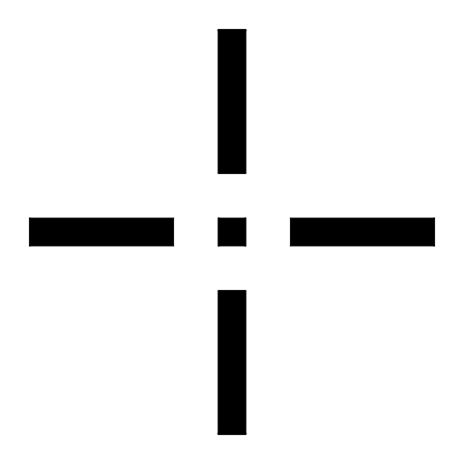

<p align="center">
  
</p>

<h1 align="center">Custom Crosshair Studio</h1>

<p align="center">
  A client-side Fabric mod that replaces the vanilla crosshair with one you design yourself.
</p>

<p align="center">
  
  
  
</p>

## Features

- **Four styles**
  - **Classic**: four arms with adjustable thickness, length, gap and an optional centre dot.
  - **Dot**: a single dot.
  - **Inverted**: the Classic shape, inverting whatever is behind it so it stays readable on any background.
  - **Drawn**: paint your own crosshair pixel by pixel on a 15×15 canvas, with pen, eraser, mirror symmetry and undo/redo.
- **Enemy crosshair**: a second, fully independent profile shown while you aim at players or hostile mobs.
- **Outline**: adjustable width and colour.
- **Live preview**: rendered by the same code as the in-game crosshair, with zoom and several backdrops.
- **Presets**: save a look and apply it to either profile.
- **Pixel-exact rendering**: consistent size at every GUI scale and symmetric on odd window sizes.
- **Vanilla behaviour kept**: hidden with F1, in inventories, on the pause and death screens and while using a spyglass; visible in chat; spectator targeting respected; optional third-person display.

## Requirements

| | |
|---|---|
| Minecraft | 1.21.8 |
| Loader | Fabric Loader 0.16.14+ |
| Required | [Fabric API](https://modrinth.com/mod/fabric-api) |
| Optional | [Mod Menu](https://modrinth.com/mod/modmenu) |
| Java | 21 |

## Usage

Open the settings from **Mod Menu**, or bind **Open Crosshair Settings** under *Options → Controls → Key Binds → Custom Crosshair Studio*. A second key toggles the crosshair on and off. Both are unbound by default.

Settings are stored in `config/customcrosshairstudio.json`.

## Building

```sh
./gradlew build
```

The mod JAR is written to `build/libs/`. Tests run as part of the build.

## License

[MIT](LICENSE)
